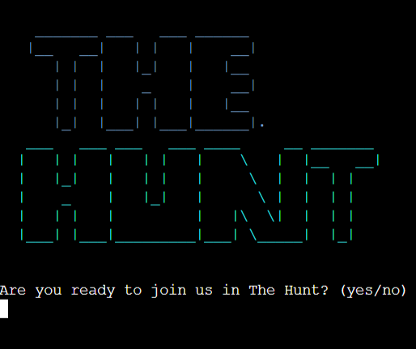
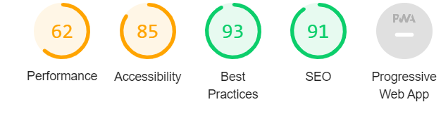

# The Hunt 

[Live link](https://the-hunters.herokuapp.com/)

[GitHub Repository](https://github.com/Sharpryan20/ci-project-3)

This is my submission for Code Institute's Portfolio Project Three. It is a text adventure Python-based game where the user will wake up inside a forest and will have to survive the night. (Each encounter will affect the user's health and insanity levels so they need to play carefully.) For the user to 'win' the game they must not reach below 0 Health or above level 5 Insanity. 

The game is deployed on Heroku and is strictly terminal-based for user interaction.

My idea for my project started when I was playing a game on my phone. I then came up with the idea of trying to captivate an audience with a thrilling and tense game where they have to use their imagination to build the story. I have tried to create multiple paths with some integrating into each other to encourage replayability. 

# UX

## Strategy 

### Vision

The Hunt is an interactive game focusing on users' interactions with the forest and how their choices will determine the path they choose. These scenarios may potentially result in the user's Health/Insanity increasing or decreasing. 

The theme of the game would be a thriller as I have tried to create tension like quick-time events to put the player on the spot and make them act impulsively.

Before I wrote any code I created the opening to the story on a notepad, with the ideas connecting as I started the creation of the story. The rest of the story the users interact with was developed further and created as and when I was coding. I would be brainstorming ideas and trying to interpret them into the story. 

Once I had a basic understanding of what my story was going to be about I started on creating my first path. I decided that creating one story path at a time and fully completing that would make it less complicated than say developing 4 paths at once. Once I had finished with the main paths I went about looking at how to integrate the paths. This will not only increase the length of time the users will spend on one run-through but encourage them to replay the game and see what other routes will lead them into. However, this got very complex when trying to remember what paths lead/integrate were so to help me I created a flow chart on [Lucid Chart](https://lucid.app/documents#/dashboard).

### Aims 

- For visitors who visit the website to have a positive user experience, despite them not being greeted with much HTML and CSS styling.

- For the game to be enjoyable and allow the users to win.

- Allow the game to be a bit more personal to each individual by allowing them to state their name and even going as far as allowing them to name the sword that they are given at the start of the game.

### Target Auidence

- My target audience is those that are interested in thriller and horror movies. This is achieved through the use of dark settings and eerie weather to draw in attention. 

- Also my target audience would be those into action. This allows them to not only watch the action like in a movie but engage with the story and make it their own. 

### User Stories 

As a new and returning user, I want to...

    - Know the theme of the game as soon as I navigate to the landing page.
    - I want to be able to interact with the game. 
    - I want it to feel more personal with choices only I can make.
    - I want to be able to distinguish between the choices I must make in the game.
    - Have an interesting and in-depth storyline.

# Features
 
## Home Page 

The home page is the only page on the application. The terminal design was created and given to me by Code Institue. 

# Technology Used in design

Throughout the planning, design, testing, and deployment of the website, I have used several technologies.

- [Python](https://www.python.org/):
    - Python is the core programming language used to write all of the code in this application to make it fully functional.
- [GitHub](https://github.com/dashboard):
    - Used to store code for the project after being pushed.
- [Git](https://git-scm.com/):
    - Used for version control by utilizing the GitPod terminal to commit to Git and push to GitHub.
- [GitPod](https://gitpod.io/workspaces):
    - Used as the development environment.
- [Heroku](https://heroku.com/):
    -Used to deploy my application.
- [Lucid Chart](https://lucid.app/users/login#/login):
    - Used to create my flow chart of the story.
- [Pep8](http://pep8online.com/):
    - Used to check my code against Pep8 requirements.

# Testing

## Functionality 

Once I had completed the story and was certain I was making no changes to it, I got a bunch of people I know to test it. I asked them each to specifically go down certain paths so I could make sure all the paths worked and integrated how they should. I also needed to know if the game was able to beat. People of all ages ranging from 17 - 55 were easily able to navigate through the game with ease.

## User Testing Stories

I needed to ensure that all user stories identified in the strategy plane were achieved.

'Know the theme of the game as soon as I navigate to the landing page.'

'I want it to feel more personal with choices only I can make.'

'I want to be able to distinguish between the choices I must make in the game.'

# Code Validation 

I ran my Python code through Pep8 online and there were no 'errors' in my code. 

# Peer Review

As a student of Code Institute, we have slack as a resource to help and complement our learning. I would like to thank students Aleksei Konovalov and David Horrocks for their incredible support and guide throughout the project. They both took time out of their way to help me through the problems that I faced in the project.

# Performance Testing 

Below is the report generated from the lighthouse via Chrome Devtools for the desktop website.

# Bugs & Fixes 

All bugs that were found during the development of the project were fixed in the process. All bugs identified are fixed now.

# Deployment

## Gitpod and GitHub

To use the terminal designed by The Code Institute I used the [Code Institute Python Essentials Template](https://github.com/Code-Institute-Org/python-essentials-template).
This allows the code that is used to run the terminal to be viewed in the browser.

## Steps:

* Click create a new repository.
* Give the repository a name.
* Under Repository template pick the [Code Institute Python Essentials Template](https://github.com/Code-Institute-Org/python-essentials-template).
* Click create repository
- Use GIT ADD.
- GIT COMMIT -m "Comments"
- GIT PUSH
- To commit the code and push to Github

## Forking the Github Repository

- Locate the desired Github repository.
- In the top right corner click the Fork button.
- The repository has been forked and you can now work 0on the copy.

## Cloning a Github repository

- Locate the desired Github repository.
- Use the code button and copy the link.
- Open Gitpod and select your directory where you want the clone to be created.
- Type git clone in the terminal and paste the link in.
- The clone will be created

## Creating an Application with Heroku

I used the video tutorial provided by The Code Institute to create a Heroku account, add the details of the app and deploy the application to a live environment.

- Log in to Heroku [Heroku](https://dashboard.heroku.com/)
- Click New 
- Give the app a name and choose the region
- Click on settings first and set the Reveal Config Vars
- PORT  = Key 8000 = Value
- If using CREDS please make sure this has been added to the requirements file.
- Add build pack include Python and Node.js
- The order of the buildpacks is important, in the list Python should be first with Node.js second. If they are not in this order, you can click and drag them to rearrange.
- Click Deploy at the top to go to the Deployment settings
- Choose GitHub as the deployment method
- Search for your app and connect
- Use Automatic deploys if you would like a new build when changes are pushed to GitHub from Gitpod
- Use Manual deploy for a new build every time this button is clicked.
- Once completed click View App.

# Credits 

* Thanks to my mentor Reuben Ferrante, for all his support throughout the project.

* Deanna Carina. Their project inspired me to create a text adventure of my own.

# Thanks 